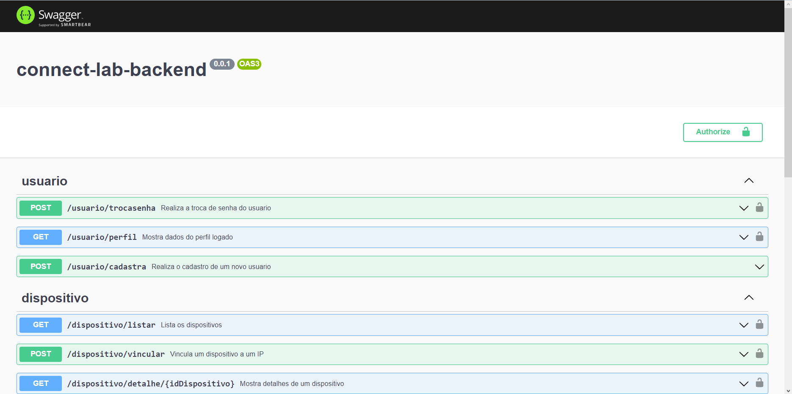
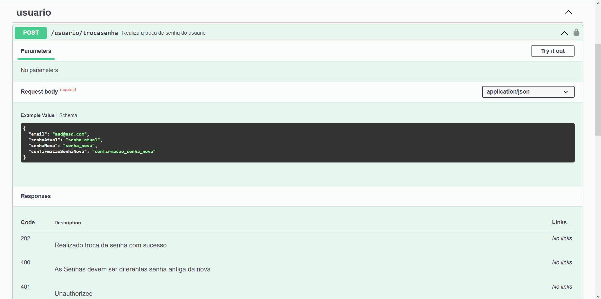
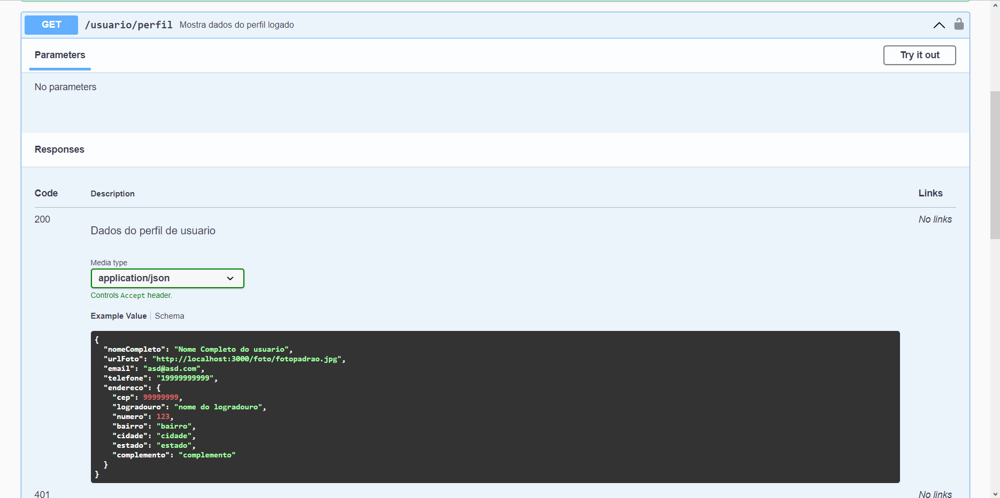
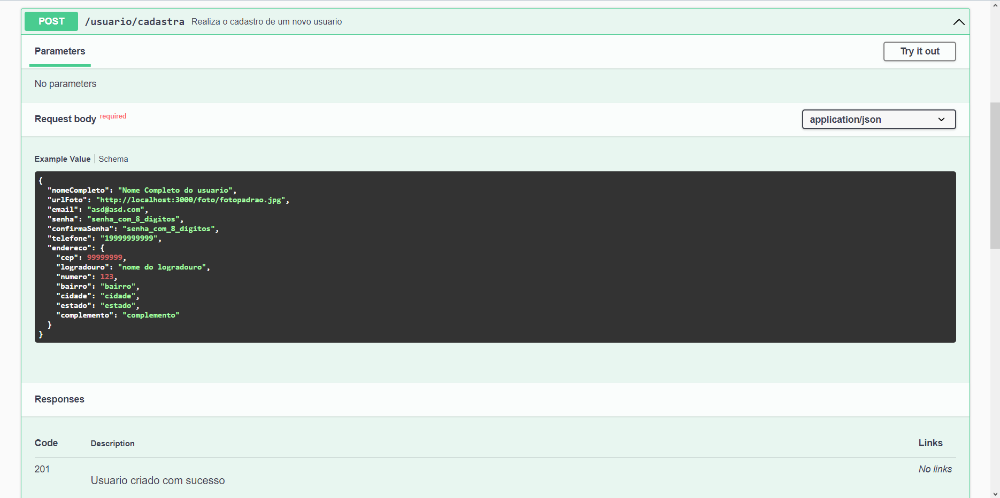

# DevInHouse Modulo 2 - Projeto Avaliativo 2 - Connect Lab backend

<h4 align="center">
 🚀 ... Concluido ... 🚀
</h4>

## Link Trello

[Projeto Avaliativo](https://trello.com/b/FBYhfowc/avaliativo)

## Descrição

Sistema backend do sistema Connect Lab

## Funções

- [x] Login usando JWT
- [x] Autenticação basica
- [x] Cadastro de novos usuarios
- [x] Troca de senha de usuario cadastrado
- [x] Vincular dispositivo com usuario
- [x] Detalhes do dispositivo por meio de ID
- [x] Listar dispositivos do usuario com filtro

## Instalação

```bash
git clone https://github.com/RDX777/DevInHouse-Modulo-2-Projeto-Avaliativo-2.git
```

```bash
cd DevInHouse-Modulo-2-Projeto-Avaliativo-2
```

```bash
npm install
```

## Executando aplicação

```bash
# Iniciar
$ npm run start

# Modo Desenvolvedor
$ npm run start:dev

# Modo Produção
$ npm run start:prod
```

## Endpoints

### Usuarios

#### Criar novo usuario [usuario/cadastra]

- Metodo
  - POST
- Headers
  - Content-Type application/json
- Body

```
{
    "nomeCompleto" : "Nome Completo Usuario",
    "email": "email@exemplo.com",
    "telefone": "1999999999"
    "senha": "senha",
    "confirmaSenha": "senha",
    "endereco": {
        "cep": 11111111,
        "logradouro": "Nome do logradouro",
        "numero": 111,
        "bairro": "Bairro",
        "cidade": "Cidade",
        "estado": "Estado",
        "complemento": ""
    }
}
```

- Response 200

```
{
    "message": "Usuario criado com sucesso"
}
```

#### Troca de senha [usuario/trocasenha]

- Metodo
  - POST
- Headers
  - Content-Type application/json
  - Authorization: Bearer [TOKEN]
- Body

```
{
    "email": "email@exemplo.com",
    "senhaAtual": "senha",
    "senhaNova": "senhanova",
    "confirmacaoSenhaNova": "senhanova"
}
```

- Response 200

```
{
    "message": "Realizado troca de senha com sucesso"
}
```

#### Perfil de usuario [usuario/perfil]

- Metodo
  - GET
- Headers
  - Content-Type application/json
  - Authorization: Bearer [TOKEN]
- Response 200

```
{
    "nomeCompleto": "Nome Completo Usuario",
    "urlFoto": "http://localhost:3000/foto/fotopadrao.jpg",
    "email": "email@exemplo.com",
    "telefone": "1999999999",
    "endereco": {
        "id": 1,
        "cep": 11111111,
        "logradouro": "Nome do logradouro",
        "numero": 111,
        "bairro": "Bairro",
        "cidade": "Cidade",
        "estado": "Estado",
        "complemento": ""
    }
}
```

### Dispositivos

#### Vincular dispositivo para um usuario [dispositivo/vincular]

- Metodo
  - POST
- Headers
  - Content-Type application/json
  - Authorization: Bearer [TOKEN]
- Body

```
{
    "id" : 1,
    "local": "Sala de jantar",
    "enderecoIP": "192.168.0.12" 
}
```

- Response 200

```
{
    "local": "Sala de jantar",
    "dispositivo": 1,
    "usuario": 1,
    "enderecoIP": "192.168.0.12",
    "estado": false,
    "id": 5
}
```

#### Listar dispositivos [dispositivo/listar?local=]

- Metodo
  - GET
- Parametro
  - local
- Headers
  - Content-Type application/json
  - Authorization: Bearer [TOKEN]
- Response 200

```
{
    "nomeUsuario": "Nome Completo Usuario",
    "listaDispositivos": [
        {
        "nomeDispositivo": "Lâmpada 20W",
        "tipo": "Lâmpada",
        "fabricante": "Intelbras",
        "local": "Sala de jantar",
        "estado": false,
        "informacoes": "Lâmpada: 20 W",
        "enderecoIP": "192.168.0.12",
        "enderecoMAC": "00:1B:44:11:3A:C0"
        },
        {
        "nomeDispositivo": "Lâmpada 10W",
        "tipo": "Lâmpada",
        "fabricante": "Intelbras",
        "local": "Sala de jantar",
        "estado": false,
        "informacoes": "Lâmpada: 10 W",
        "enderecoIP": "192.168.0.12",
        "enderecoMAC": "00:1B:44:11:3A:B8"
        }
    ]
}
```

#### Listar dispositivos [dispositivo/detalhe/{ID DISPOSITIVO}]

- Metodo
  - GET
- Headers
  - Content-Type application/json
  - Authorization: Bearer [TOKEN]
- Response 200

```
{
    "nomeDispositivo": "Lâmpada 15W",
    "tipo": "Lâmpada",
    "fabricante": "Intelbras",
    "local": "Dispositivo não vinculado a este usuario",
    "estado": "Dispositivo não vinculado a este usuario",
    "informacoes": "Lâmpada: 15 W",
    "enderecoIP": "Dispositivo não vinculado a este usuario",
    "enderecoMAC": "00:1B:44:11:3A:B9"
}
```

### Token

#### Criação de um token [auth/token/cria]

- Metodo
  - POST
- Headers
  - Content-Type application/json
- Body

```
{
    "email": "email@exemplo.com",
    "senha": "senha"
}
```

- Response 200

```
{
     "token": "{TOKEN}"
}
```

## Testes

Não foram implementados testes

### Tecnologias

- [Node.js](https://nodejs.org/)
- [Javascript](https://developer.mozilla.org/pt-BR/docs/Web/JavaScript)
- [NestJS](https://nestjs.com)
- [Swagger for NestJS](https://docs.nestjs.com/openapi/introduction)
- [TypeORM](https://typeorm.io)
- [TypeScript](https://www.typescriptlang.org)
- [Postgres](https://www.postgresql.org)

## Demostrativo da tela implementação swagger

### Tela 1

<h1 align="center">
  
</h1>

### Tela 2

<h1 align="center">
  
</h1>

### Tela 3

<h1 align="center">
  
</h1>

### Tela 4

<h1 align="center">
  
</h1>

Nest is [MIT licensed](LICENSE).
